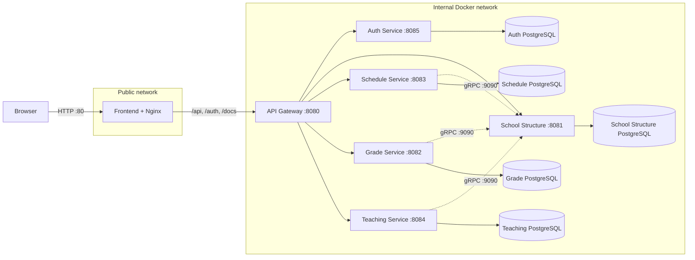

# Classly - School Management System

## Project Overview

Classly is a full-stack school management application built on a **Spring Boot Microservices** architecture. It handles grades, class schedules, attendance, assessments, and the core school structure (students, teachers, parents, groups, subjects).

### Architecture Components

- **API Gateway** - the only public entry point; routing and JWT verification
- **Auth Service** - login, access-code registration, JWT issuing/refresh
- **School Structure Service** - managing students, teachers, parents, groups, subjects, teaching assignments
- **Schedule Service** - recurring schedule rules, per-date overrides, one-off additional lessons
- **Grade Service** - grades, semester grades
- **Teching Service** - lesson sessions, attendance, assessments
- **common** - shared library for JWT verification and authorization
- **PostgreSQL** - one database instance per service



---

## Technologies

[](https://www.oracle.com/java/)
[](https://spring.io/)
[](https://spring.io/projects/spring-security)
[](https://spring.io/projects/spring-cloud-gateway)
[](https://www.postgresql.org/)
[](https://www.docker.com/)
[](https://grpc.io/)
[](https://maven.apache.org/)
[](https://springdoc.org/)
[](https://jwt.io/)
[](https://flywaydb.org/)
[](https://projectlombok.org/)

---

## Quick Start

### Prerequisites

- **Java 17+**
- **Maven 3.9+**
- **Docker & Docker Compose**
- **Git**

### Installation

```bash
# Clone the repository
git clone https://github.com/MaksymWoloszynowski/Classly.git
cd Classly
```

Create the local environment files for the backend services. Each file must contain the same shared JWT secret:

```bash
cp backend/api-gateway/.env.example backend/api-gateway/.env
cp backend/auth-service/.env.example backend/auth-service/.env
cp backend/grade-service/.env.example backend/grade-service/.env
cp backend/schedule-service/.env.example backend/schedule-service/.env
cp backend/school-structure-service/.env.example backend/school-structure-service/.env
cp backend/teaching-service/.env.example backend/teaching-service/.env
```

Replace the example value in all six `.env` files with the same secret of at least 32 characters. 

### Running with Docker

```bash
docker compose up -d --build
```

The frontend will be available at `http://localhost`. Backend service ports are not published to the host.

---

## API Endpoints

All browser requests go through the frontend at `http://localhost`, which proxies them to the internal API Gateway.

### Public Endpoints

```bash
POST   /auth/login           
POST   /auth/register              
POST   /auth/refresh           
```

### Protected Endpoints examples (require a valid access token)

```bash
GET    /api/student/{id}
GET    /api/schedule/student?groupId&from&to
GET    /api/grade?studentId=...
GET    /api/attendance?sessionId=...
POST   /api/assessment
```

Full endpoint documentation is available per service via Swagger UI (see below).

---

## Configuration

### Service Ports

```yaml
Frontend:                  80 (published)
API Gateway:               8080 (internal)
School Structure Service:  8081 (internal)
Grade Service:             8082 (internal)
Schedule Service:          8083 (internal)
Teaching Service:          8084 (internal)
Auth Service:              8085 (internal)
```

### Database

Each service owns its own PostgreSQL database and applies its own Flyway migrations on startup. Database credentials are mounted into the containers as Compose secrets named `DB_USER` and `DB_PASSWORD`.

Before starting the complete stack, create the root environment file:

```bash
cp .env.example .env
```

Set a real `JWT_SECRET` and strong database passwords in `.env`. For standalone service Compose files, use the corresponding service `.env` file.

---

## Testing

### Registration 

There are three available accounts, each one with different role:

| Role | Access code |
| -------- | ------- |
| Student | 1111 |
| Teacher | 2222 |
| Parent | 3333 |

### Example API Calls

```bash
# 1. Register using an access code
curl -X POST http://localhost/auth/register \
  -H "Content-Type: application/json" \
  -d '{"email": "student@example.com", "password": "Password123", "accessCode": "1111"}'

# 2. Log in
curl -i -c cookies.txt -X POST http://localhost/auth/login \
  -H "Content-Type: application/json" \
  -d '{"email": "student@example.com", "password": "Password123"}'

# 3. Call a protected endpoint
curl -X GET http://localhost/api/student \
  -b cookies.txt
```

### API Documentation (Swagger)

OpenAPI documentation is routed through the frontend without publishing service ports:

```
http://localhost/docs/school-structure/swagger-ui.html
http://localhost/docs/grade/swagger-ui.html
http://localhost/docs/schedule/swagger-ui.html
http://localhost/docs/teaching/swagger-ui.html
```

---

## Project Structure

```
Classly/
│
├── backend
│   ├── api-gateway/           
│   ├── auth-service/              
│   ├── school-structure-service/  
│   ├── schedule-service/           
│   ├── grade-service/              
│   ├── teaching-service/           
│   └── common/   
│
├── data
│   ├── 01_school_structure.sql          
│   ├── 02_schedule.sql     
│   ├── 03_grade.sql  
│   └── 04_teaching.sql
│
├── frontend
│    └── src/           
│        ├── api/              
│        ├── components/  
│        ├── context/           
│        ├── hooks/              
│        ├── i18n/
│        ├── layouts/              
│        ├── pages/  
│        ├── styles/           
│        ├── types/              
│        └── utils/
│
├── docker-compose.yaml
└── README.md
```

Each service has its own `README.md` with service-specific endpoints, entities, and gRPC dependencies.

---